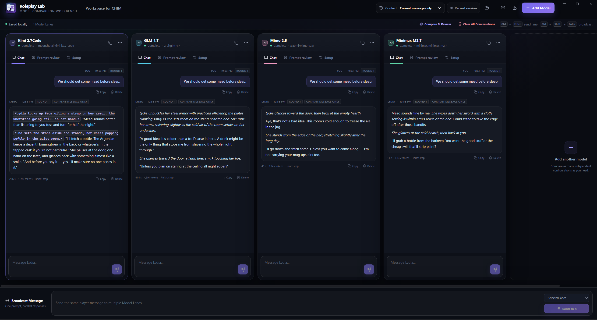

# Roleplay Lab

<p align="center">
  
</p>

Roleplay Lab is a Windows desktop workbench for testing OpenAI-compatible language models side by side. It is designed for roleplay, NPC dialogue, character consistency, and prompt iteration rather than general-purpose multi-model chat.

Each Model Lane can use a different endpoint, API key, model, generation configuration, roleplay context, and memory policy. Shared messages make it easy to compare responses under the same conditions.

## Features

- Add, reorder, duplicate, and remove any number of side-by-side Model Lanes.
- Configure an OpenAI-compatible API base URL, API key, model ID, request timeout, and custom headers per lane.
- Fetch model IDs from `/v1/models` when supported, or enter them manually.
- Configure temperature, Top P, Top K, token limits, penalties, seed, stop sequences, structured reasoning options, and provider-specific JSON parameters.
- Define a system prompt, player name, NPC name, character biography, and scenario for each lane.
- Import prompt context from TXT, Markdown, or CSV files.
- Send messages to one lane or broadcast the same message to multiple lanes in parallel.
- Choose full-history, sliding-window, or fresh-turn memory globally or per lane.
- Delete individual messages, clear one conversation, or clear every conversation.
- Run a per-lane Prompt Review using either the tested model or a separate reviewer connection.
- Run a global Compare & Review with a dedicated reviewer endpoint and model.
- Review one comparison round, selected rounds, or all settled rounds in chronological order.
- Compare results using the actual lane and model names, then copy or export the Markdown report as a `.txt` file.
- Optionally record human-readable Markdown session logs.

## API compatibility

Roleplay Lab uses OpenAI-compatible endpoints:

```text
GET  /v1/models
POST /v1/chat/completions
```

Streaming SSE responses and regular JSON chat-completion responses are supported. Model discovery is optional, so providers that do not expose `/models` can still be used with a manually entered model ID.

Local endpoints can be used without an API key.
Use only base URL when configuring, e.g: https://openrouter.ai/api/v1

## Roleplay variables

The following variables can be used in system prompts, biographies, scenarios, and player messages:

```text
#PLAYER_NAME#
#HERIKA_NAME#
#NPC_NAME#
```

They are replaced with the configured player and NPC names before requests are sent.

## Getting started

### Portable Windows build

Download the latest portable executable from the repository's Releases page, then run it without installation.

The executable may trigger a Windows SmartScreen warning when it is distributed without a code-signing certificate.

### Run from source

Prerequisites:

- Node.js 22.12 or newer
- pnpm
- Windows

Install dependencies and start the development build:

```powershell
pnpm install
pnpm dev
```

Regenerating the application icons is optional and requires Python 3 with Pillow:

```powershell
python scripts/generate_icon.py
```

---

### Tips for using the app

First thing I'd advise is setting up the character bio, scenario, system prompt etc. for one model lane, then using **clone** (copy icon) next to it. This will save you time so you don't have to set everything manually for each model, again. You can then change model, paramaters and similar more easily.

**Base URL** - It should end with /v1 (not entire /chat/completions endpoint). Example for OpenRouter: https://openrouter.ai/api/v1

**Fetch Models** - You can use this button to automatically fetch models from your endpoint. You can then select them from the dropdown box, or start typing which would show you the closest matches from that dropdown box.

**Compare & Review** - Set your max_tokens to something high, as by default, the model for review will rank all the models, point out their good and bad sides, and then give you a complete revised prompt. 

**Prompt review** - The tab in each model lane is a review of **that model's response only**. Use global **"Compare & Review"** button above model lanes for ranking and comparison of selected lanes.

**Clear All Conversations** - Use this button when you want to clear all the conversations, which will then reset the "rounds" for each model (and therefore remove it from prompt review history). You may also delete specific messages by selecting "Delete" next to the message in chat window.

**Context** - Set to "Full History" to have chats retain memory of previous conversations. Set to "Current Message only" if you want each subsequent response to focus **only** on your last message (no history)

**Record Session** - In short, enables logs.

**Export / Import Workspace** - Exports or Imports your current workspace. That includes all your configuration in regards to models, prompts, parameters, bios/characters etc. The thing that is **not** saved is your API key for security purposes.


## Validation and packaging

```powershell
pnpm typecheck
pnpm test:roleplay
pnpm test:transport
pnpm package:win
```

- `typecheck` validates the Electron main process, preload bridge, shared types, and React renderer.
- `test:roleplay` covers roleplay-variable rendering, conversation-memory safety, and multi-round comparison artifacts.
- `test:transport` uses a local mock OpenAI-compatible provider to verify model discovery, streaming, cancellation, error isolation, request parameters, and persistence.
- `package:win` creates an x64 portable Windows executable in `release/`.

## Privacy and local data

- The application has no telemetry.
- Workspaces are stored locally and restored on launch.
- API keys are encrypted through Electron `safeStorage` when OS-backed encryption is available.
- Raw API keys and credential references are removed from exported workspaces.
- Session logging is disabled by default.
- Prompt Review and Compare & Review send the selected prompts, context, requests, and responses to the reviewer endpoint configured by the user.

## Project structure

```text
resources/          Application icons
scripts/            Regression and transport tests
src/main/           Electron main process
src/preload/        Context-isolated renderer bridge
src/renderer/       React user interface
src/shared/         Shared types and defaults
```

## Contributing

Bug reports, focused pull requests, and compatibility notes for OpenAI-compatible providers are welcome. Please run the type checks and relevant tests before submitting a change.

## Support Link
https://ko-fi.com/segarega

## License and attribution

Copyright (C) 2026 segarega.

Roleplay Lab is licensed under the [GNU Affero General Public License v3.0 only](LICENSE).

Copyright and attribution information is provided in [NOTICE](NOTICE). Redistributions must retain applicable copyright and license notices as required by the AGPL.
